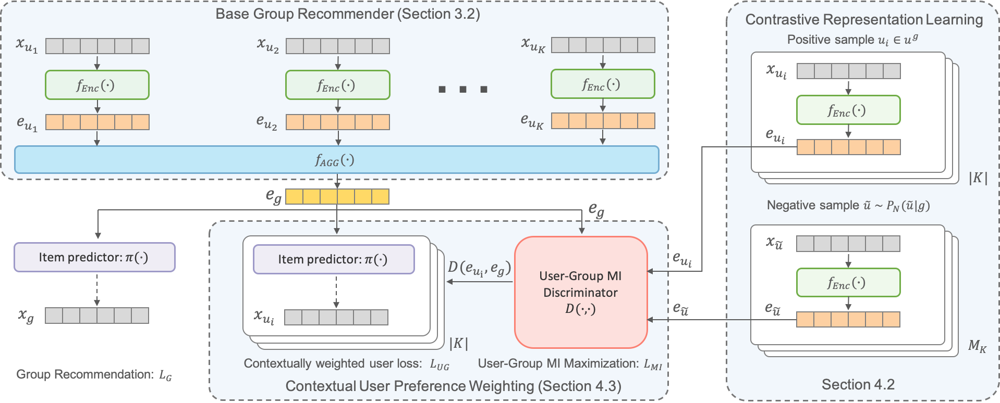

## GroupIM: A Mutual Information Maximization Framework for Neural Group Recommendation

##### Contributors: [Aravind Sankar](http://asankar3.web.engr.illinois.edu/) (asankar3@illinois.edu).

> Aravind Sankar, Yanhong Wu, Yuhang Wu, Wei Zhang, Hao Yang and Hari Sundaram, "GroupIM: A Mutual Information 
Maximization Framework for Neural Group Recommendation", International ACM SIGIR conference on
               research and development in Information Retrieval, 
<b>SIGIR
 2020</b>, Virtual Event, China, July 25-30, 2020.

This repository contains a PyTorch implementation of Group Information Maximization (GroupIM) -  a neural framework for recommending items to groups of users. 
GroupIM has three modules: user preference encoder, group preference 
aggregator, and a training objective over user and group interactions with mutual information maximization. GroupIM 
supports arbitrary preference encoder and aggregator architectures for group recommendation. 



### Requirements
The code has been tested running under Python 3.6 with the following packages installed (along with their dependencies):


```
numpy==1.18.1
pandas==1.0.3
scikit-learn==0.23.1
scipy==1.4.1
torch==1.1.0
```
To guarantee that you have the right package versions, you can use Anaconda to set up a virtual environment and install the above packages.

### Input Format

This repository includes one dataset ``Weeplaces`` for POI recommendation to groups of users.
The set of all groups are randomly partitioned into training (70%), validation
(10%), and test (20%) sets, while individual user-item interactions of all users are used for training 
The validation and test sets contain strict ephemeral groups (<i>i.e.</i>, a
specific combination of users) that do not occur in the training set.


In order to use your own data, you have to provide the following files:

- ``train_ui.csv``: a csv file specifying the training set of user-item interactions (one 
pair per line) where each line contains a ``(u, i)`` pair.

- ``val_ui_tr.csv, test_ui_tr.csv``: csv files specifying fold-in item interactions for the validation and test sets 
of users. 


- ``val_ui_te.csv, test_ui_te.csv``: csv files specifying held-out item interactions for the validation and test sets 
of users. This set may be used to evaluate user-level item recommendation performance.


- ``train_gi.csv, val_gi.csv, test_gi.csv``: csv files specifying group-item interactions (one 
pair per line) where each line contains a `(g, i)` pair.

- ``group_users.csv``: a csv file specifying group memberships of all users and groups in the dataset where each line contains a ``(g, u)`` pair indicating that user `u` belongs to group `g`. 

### Repository Organization
```
.
├── [6.5M]  data # contains the necessary input file(s) for each dataset in the specified format.
│   └── [6.5M]  weeplaces
│       ├── [794K]  group_users.csv
│       ├── [156K]  test_gi.csv
│       ├── [433K]  test_ui_te.csv
│       ├── [635K]  test_ui_tr.csv
│       ├── [498K]  train_gi.csv
│       ├── [3.5M]  train_ui.csv
│       ├── [ 72K]  val_gi.csv
│       ├── [205K]  val_ui_te.csv
│       └── [300K]  val_ui_tr.csv
├── [9.1K]  eval
│   ├── [3.4K]  evaluate.py # helper functions to evaluate recommendation performance
│   └── [1.6K]  metrics.py # ranking metrics NDCG and Recall at K
├── [199K]  GroupIM.png
├── [1.5K]  LICENSE
├── [ 18K]  models
│   ├── [3.5K]  aggregators.py # group preference aggregator
│   ├── [2.6K]  discriminator.py # discriminator for mutual information estimation and maximization
│   ├── [2.3K]  encoder.py # user preference encoder
│   └── [5.8K]  models.py # GroupIM model 
├── [4.2K]  README.md
├── [  90]  requirements.txt
├── [ 12K]  train.py
└── [ 17K]  utils
    ├── [9.4K]  group_utils.py # mini-batch loaders for group-item interactions
    ├── [   0]  __init__.py
    └── [3.4K]  user_utils.py # mini-batch loaders for user-item interactions

 6.8M used in 5 directories, 23 files
```

### Running the Model
To train and evaluate the model (<i>e.g.,</i> on `weeplaces`), please run
```bash
python train.py --dataset weeplaces --cuda --pretrain_user --pretrain_mi
```

Note: The model is not deterministic. All the experimental results provided in the paper are averaged across multiple
 runs.
 
 
## Reference
- https://github.com/CrowdDynamicsLab/GroupIM.git

 If you make use of this code or the GroupIM algorithm in your work, please cite the following paper:

```
@inproceedings{sankar2020groupim,
  title     = {GroupIM: A Mutual Information Maximization Framework for Neural Group Recommendation},
  author    = {Sankar, Aravind and Wu, Yanhong and Wu, Yuhang and Zhang, Wei and Yang, Hao and Sundaram, Hari},
  doi       = {10.1145/3397271.3401116},
  booktitle = {Proceedings of the 43rd International ACM SIGIR Conference on Research and Development in Information Retrieval},  
  pages     = {1279--1288},
  year = {2020}
}
```